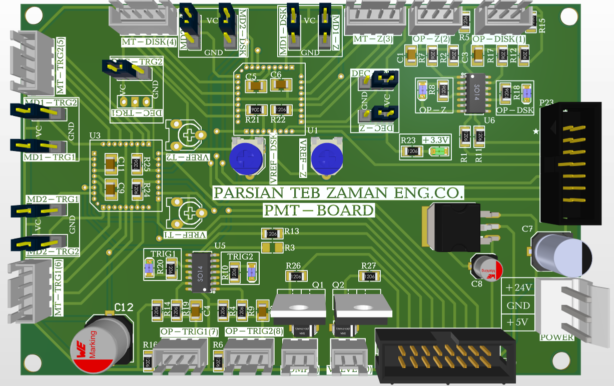
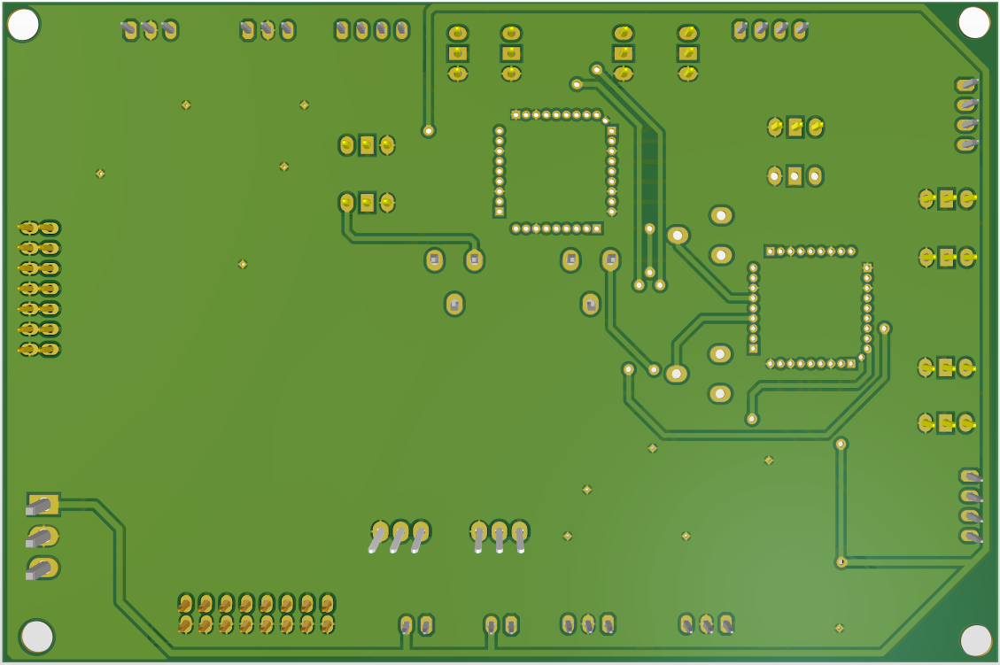
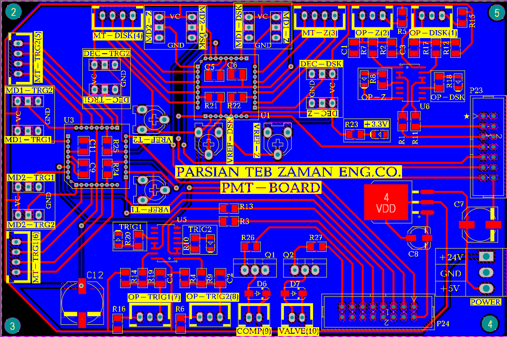
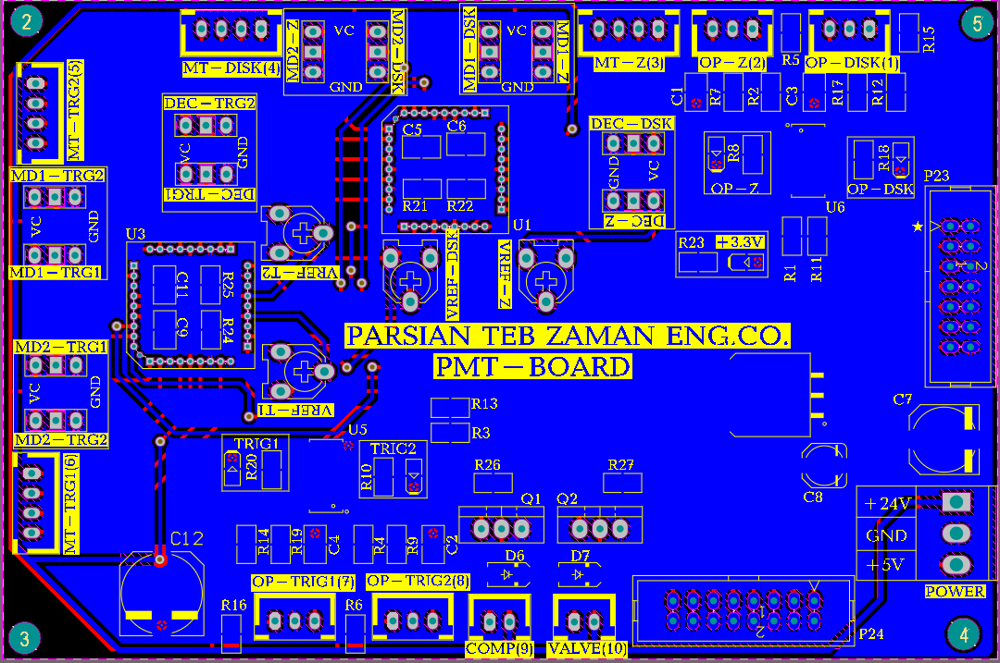

# Laboratory Sample Reagent Processing Controller (PMT - Board)

## 📌 Overview
The **PMT - Board** (designed by **Parsian Teb Zaman Eng. Co.**) is a specialized control and signal conditioning PCB engineered for medical and laboratory automation equipment.

### Key Features:
- **Multi-Channel Interfacing:**
  - Motor / Actuator / Sensor Headers (`MT-DISK`, `MT-Z`, `MT-TRG1`, `MT-TRG2`).
  - Solenoid Valve & Pump Control Channels (`VALVE`, `COMP`).
- **Signal Conditioning & Sensing:**
  - Multi-channel Op-Amp signal processing ICs (`SO-14` packages) for sensor feedback and limit switching.
  - Precision potentiometers for `VREF` tuning (`VREF-Z`, `VREF-DSK`, `VREF-T1`, `VREF-T2`).
- **Expansion & System Bus:** High-density DIN / IDC connectors (`P23`, `P24`) for main system communication and control signals.

---

## 📂 Repository Structure

- 📄 [PMT_schematic.pdf](PMT_schematic.pdf) — Full Circuit Schematic Diagram
- 📊 [BOM_PMT.xlsx](BOM_PMT.xlsx) — Complete Bill of Materials (Component List)
- 🖼️ [3d_top_view.png](3d_top_view.png) — 3D PCB Render (Top View)
- 🖼️ [3d_bottom_view.png](3d_bottom_view.png) — 3D PCB Render (Bottom View)
- 🖼️ [pcb_layout_top.png](pcb_layout_top.png) — PCB Top Layer Copper & Silkscreen
- 🖼️ [pcb_layout-bottom.png](pcb_layout-bottom.png) — PCB Bottom Layer Copper & Silkscreen

---

| Schematic Diagram | Bill of Materials (BOM) |
| :--- | :--- |
| 📄 [Download Schematic PDF](PMT_schematic.pdf) | 📊 [View Bill of Materials (BOM)](BOM_PMT.xlsx) |

---

## 🖼️ Visuals

### 3D Model Render

| Top View | Bottom View |
| :---: | :---: |
|  |  |

### PCB Layout Design

| Top Layer | Bottom Layer |
| :---: | :---: |
|  |  |
